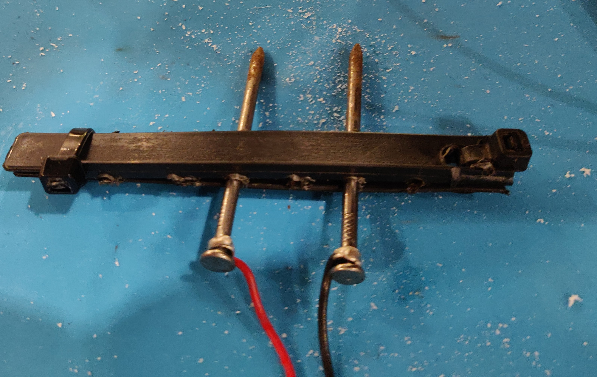
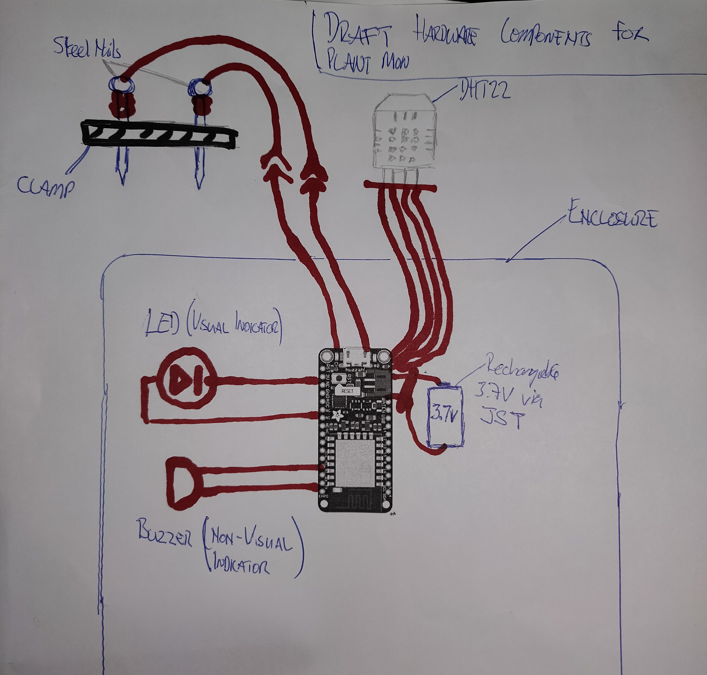
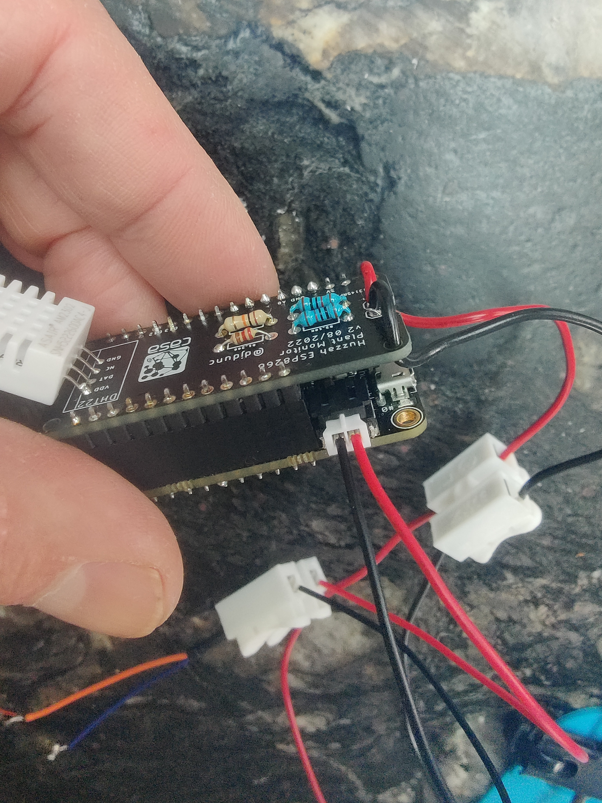
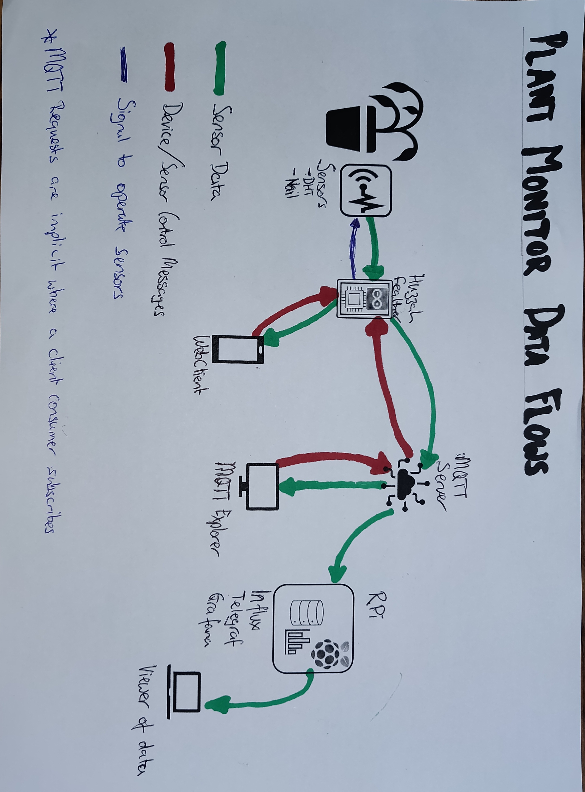

# ESP8266 Plant Health Monitor
## Overview
 ESP8266 Plant Monitor - this plant monitor is set up to take readings of soil moisture, air temperature and# humidity levels. It does this through dedicated hardware (ESP8266 with a DHT and a homemade basic steel nail resistance monitor). The ESP's onboard WiFi adapter is used to connect to a network. Readings from the sensors are posted to a remote MQTT server. The core of the project is based on content from UCL's Connected Environments module within the Connected Environments MSc Programme.
 

 ## Details of the circuit used to connect to the sensors
The ESP is configured to use two sensors. The DHT22 for air temperature and humidity and a resistance sensor which is has been created using steel nails as electrodes. 
The DHT22 is has three connections in use. The ESP’s 3V pin is connected to the VCC (Pin 1) of the DHT22. D12 is connected to the DHT’s Data pin (pin 2). These two connections are linked by 10k ohm resistor. The DHT’s 4th pin is connected to the ground pin. Note the DHT’s pin 3 is not used.
For the soil sensor, an analogue measurement is used. Pin 13 is used as VCC to supply the power to one nail. The second nail is attached to ground via a 10k ohm resistor and to ADC/A0 of the ESP via a voltage divider. The divider using a 200 ohm and a 100 ohm resistors to get the correct ratio. The voltage is dropped to ~1.1V for the analogue read. This is around the operating voltage of the board’s analogue to digital converter.
### Steel Nail Soil Sensor in Homemade Clamp



### Draft sensor component setup and enclosure boundary


Some further additions were made to allow in person/physical monitoring of the device. An active buzzer and LED we connected to D14 and ground. No resistor was required for the LED here due to the connection to the active buzzer.
To make use of the board’s sleep modes, a connection was made between the RST and Pin 16.
### RST to Pin16


For the device, power was supplied via a rechargeable 3.7V batter which connects to via the JST jack. 
### Pre-wired JST Connector – with wires the wrong way around!


### Breadboard Prototype


A physical latching switch for powering down the device was added to the power supply lead to enable switched the device on and off.
### Overview of flow and controls


## The Code
The device communicates its readings through WiFi so a connection is made through a known and preconfigured network. Credentials stored in a config file. The code is set up to automatically try a back up if the primary network is not available. A smarter method for future iterations would be to hold a list of connections that could be cycled through. 

```
//connection code to try backup if not found
void connectToWiFi(){
  bool usingBU = false; //back up
  const char* usingSSID = ssid;
  const char* usingPwd = password;

  //connect to wifi
  WiFi.begin(usingSSID, usingPwd);
  
  int count = 0;
  //wait for wifi connection - use back up if primary not available
  while (WiFi.status() != WL_CONNECTED){
    Serial.print(".");
    delay(500);
    if (count > 30){
      usingBU != usingBU;
```
The publication of data is via an MQTT broker. A connection to this is established in a similar way with stored credentials. Note that this connection needs to be kept active. This is down using the the MQTT library’s loop method (client.loop() in the code). During testing connections not used for over 20 seconds saw disconnections.
A webserver is also set up to allow more direct communication than via MQTT but currently not used as the power management set up used will make this unavailable for periods. More on this below.
In testing the power consumption of the device depleted its 3.7V Li-Ion battery in around 48 hours. Recharging at these intervals is not ideal. By connecting the RST and Pin 16 the board will have the capability to sleep and wake at a specified point. This is much more power efficient than being in a constant loop and using delay is not a solution if power consumption is the issue.  The code below shows how to drop into sleep. No extra libraries are required, just the hardware connection. Note that the interval is in micro not milliseconds.   
```
  //wifi connection will be dropped so only use when sleeping for a longer period
  ESP.deepSleep(1.2e8); 
  
```
This power saving doesn’t come for free, there are downsides. When dropping into sleep (light or deep), the board shuts down its wireless connection capabilities. This means that when it wakes, any required connections need to be reestablished. There is overhead performing this and time required to set these up again. Messages and requests could be missed. Hence, the webserver isn’t ideal and it eats up more power.

The sensors 
The sensors are monitored on an interval basis. This is based on the sleep cycle but even when using without sleep, monitoring these readings to frequently has no benefit. When the readings are due updateReadings() is called. The soil moisture reading is taken first because this takes the longest time as the current is applied and needs a period to settle. The temperature and humidity readings are then taken. 
To read the soil moisture, pin 13 is powered and for 100ms. An analogue read is then taken and  pin 13 dropped to LOW again.
For the DHT reading, a instance of the DHT class is created during the initial set up and bound to the pin used (12) for the data. A reading is taken from the instance for each of the temperature and humidity.
The readings are then sent to MQTT via the sendMQTT() function. The values are then published to their respective topics. Note that the format below is used for the base path of the device with its own subtopics below this level:
"student/CASA0014/plant/{username}/{building}/{Floor}/{Room}/{device ID}”
```
    snprintf (msg, 50, "%.0i", Moisture);
    client.publish((plantTopic + "moisture").c_str(), msg);

```
 A timestamp and checksum are also sent. The check sum uses a simple algorithm to select a specific character from a randomised string in the config file.

```
String sendTime = UTC.dateTime("ymd His.v");
client.publish((plantTopic + "check").c_str(), codeString(sendTime).c_str());

//########################################################
// simple cipher function for checksum
//########################################################
String codeString(String str){
  //String last2Chars = str.substring(str.length() - 2);
  //str.substring(str.length() - 2) gets the last 2 chars of millisecs
  // the ".toInt()" casts them to int
  // this 0-99 values is used to grab the chardacter at that position in the cypher
  return String(cypher[str.substring(str.length() - 2).toInt()]);
}

```
The values do not always need to be read. There are Booleans that dictate is a value should be read and sent. If a sensor is set to “stop” reading via these Booleans, its reading will be skipped. The method of communicating this is below.
These Booleans control the readings:
```
bool stopTemp = false;
bool stopHum = false;
bool stopMoist = false;

```
And are reset on the during callback if the topics are present:

Should a sensor have an issue, it can be switched off remotely. This is done through MQTT. A subscription is made and callback set so that when a value is published on a topic that has been subscribed to, the device will receive it and can take action. A value of 1 means stop, otherwise take and publish the reading.
```
  //remotely switch on and off the sensors/readings and physical alerts
  if (strcmp(topic, "student/CASA0014/plant/…/stoptemp/") == 0) {
      if ((char)payload[0] == '1'){
        Serial.println("Stopping temp");
        stopTemp = true;
      } else{
        Serial.println("Starting temp");
        stopTemp = false;
      }
   } 

```

Acceptable ranges are configured for the readings and checked in checkValuesAreGood() . Should a reading be outside this range, the warnings are published to MQTT and on the physical device using an LED and buzzer. This may be annoying so this too can be shut down remotely.

Although the device responds to remote instructions, it doesn’t always do this immediately. This is being debugged. The suspicion being this is linked to deep sleep.

For monitoring, a python script runs that subscribes to the MQTT topics and notifies the operator via the console and email. This method was selected rather than a method where the user was expected to check back, rather than be notified.

Data from the device is consumed by Influx DB and the Python script for immediate use and storage.

## Next Steps
Some further work is required to optimise the power settings and sleep cycles. The use of Millis should be investigated here too.
Development of more aesthetically pleasing interface would be a good addition here too.

## License
This code is provided under the MIT license 


